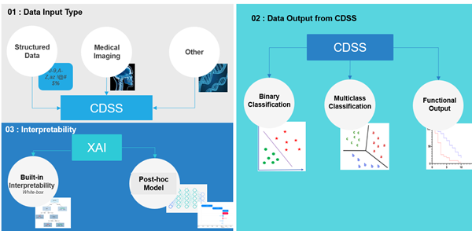

# XAI Taxonomic Guide for Clinical Decision Support Systems

## 
This Taxonomic Guide is designed to support CDSS developers in finding suitable XAI methods for their applications. Commonly used XAI models and related clinical use cases are listed below.

This repository was created as part of the PhD project of Dr. Lasantha Ranwaala, University of South Australia.

To follow our taxonomy, user need to answer three basic questions about the CDSS they intended to generate explanations .
1.	What is the input data type of the CDSS?
2.	What is the output type of the CDSS?
3.	Does the CDSS require an explanation model that is inherently easy to understand from the start (White box), or can it be added after the model has undergone training (post-hoc)?

### [Clinical Uses: CDSS with Structured Data Inputs](#structured_data)
### [Clinicla Uses : CDSS with Imaging Data Inputs](#images)
### [XAI Models Details](#xai_1)

## Structured_Data
## Clinical Uses : XAI Application for CDSS Models with Structured Data Inputs
| CDSS Output Category | XAI Model Type | Model Specifity  | XAI model/s| Clinical Scenario  |
|----------------------|----------------|---------------|----------|----------------------------|
|           |             | |                                                                            |                                                                                                                          |
| Binnary Calssification    | Post-hoc                  | Model-Agonostic | LIME                                                                       | [Sleep apnea prediction](https://www.sciencedirect.com/science/article/pii/S1877050922012406) [Breast Cancer Metastasis prediction](https://doi.org/10.1109/TBME.2023.3282840)                                                 |
|                           |                           |                 |                                                                            | [Detection of COVID-19 before the onset of symptoms](https://doi.org/10.1016/j.imu.2022.100941)                                                                |
|                           |                           |                 | Modified LIME                                                              | [COVID-19 prediction](https://doi.org/10.1016/j.ijcce.2023.01.003)                                                                                                 |
|                           |                           |                 | SHAP                                                                       | [Predicting Occurrence of Acute Kidney Injury after Cardiac surgery](https://doi.org/10.31083/j.rcm2408229)                                                  |
|                           |                           |                 |                                                                            | [Cervical cancer prediction using behavioral risk factors](https://doi.org/10.1016/j.health.2024.100324)                                                           |
|                           |                           |                 |                                                                            | [Predicting the conversion of clinically isolated syndrome (CIS) to clinically definite multiple scle­rosis (CDMS)](https://doi.org/10.1016/j.msard.2024.105614) |
|                           |                           |                 |                                                                            |  [predict 1-year survival after palliative radiotherapy (RT) for bone metastasis](https://doi.org/10.1200/CCI.24.00027)                                |
|                           |                           |                 |                                                                            | [Breast cancer detection](https://doi.org/10.1109/I2CT61223.2024.10543965)                                                                                            |
|                           |                           |                 | SHAP & LIME                                                                | [Prediction of diabetes Management](https://go.openathens.net/redirector/unisa.edu.au?url=https://www.proquest.com/scholarly-journals/explainable-artificial-intelligence-xai/docview/2858093357/se-2?accountid=14649),[Diabetes prediction using machine learning](https://doi.org/10.1049/htl2.12039) [C-Section prediction](https://doi.org/10.1016/j.compbiomed.2022.105671)                                                            |
|                           |                           |                 |                                                                            | [Parkinson’s Speech  Detection](https://doi.org/10.1109/ICCAR61844.2024.10569414)                                                                                    |
|                           |                           |                 | SHAP,LIME,ELI5,Qlattice                                                    | [Detection of Polycystic Ovary Syndrome](https://doi.org/10.3390/asi6020032)                                                                              |
|                           |                           |                 | SHAP,Decision tree ,Rule based system                                      | [Intensive care unit mortality prediction of neonate patients](https://doi.org/10.1016/j.jbi.2022.104216)                                                        |
|                           |                           |                 | SHAP,LIME,ELI5,Qlattice, Anchors                                           | [Gestational diabetes mellitus prediction using clinical and laboratory markers](https://doi.org/10.1080/23311916.2024.2330266)                                 |
|                           |                           |                 | DeepExplainer                                                              | [Lung Cancer Detection](https://doi.org/10.1016/j.cmpb.2023.107879)                                                                                               |
|                           |                           |                 | MVR-GA                                                                     | [Accurate hepatotoxicity prediction](https://doi.org/10.1109/BIBM55620.2022.9995667)                                                                                  |
|                           |                           |                 | Araucana XAI                                                               | [Prediction of hospitalization outcome of patients with liver dieases. & Prediction of death in ICU patients](https://doi.org/10.1016/j.artmed.2022.102471)        |
|                           | Built-in Interpretability | Model-specific  | OVBLR-SFE                                                                  | [An intensive care unit readmission prediction case for liver transplantation patients](https://doi.org/10.1016/j.eswa.2023.121138)                                |
|                           |                           |                 |                                                                            |                                                                                                                          |
| Multiclass Classification | Post-hoc                  | Model-Agonostic | ELIS5                                                                      | [Brain tumor classification](https://doi.org/10.1016/j.procs.2023.01.182)                                                                                           |
|                           |                           |                 | SHaP                                                                       | [Predict the risk factors related to the direct association between obesity and comorbidities](https://doi.org/10.1109/e-Science58273.2023.10254948)                        |
|                           |                           |                 | LIME                                                                       | [Predict cardiovascular disease risk](https://doi.org/10.1109/BIBM58861.2023.10385315)                                                                                |
|                           |                           |                 | AnEMIC                                                                     | [A Framework for benchmarking ICD Coding Models](https://doi.org/10.18653%2Fv1%2F2022.emnlp-demos.11)                                                                      |
|                           |                           |                 | SHAP & LIME                                                                | [Predicting fetal abnormalities base on  cardiotocography readings](https://doi.org/10.1109/AAIAC60008.2023.10465473)                                                   |
|                           |                           | Model-specific  | VDJMiner                                                                   | [Mine the underlying medical conditions and predict the prognosis of COVID-19](https://doi.org/10.1093/bib/bbac555)                                         |
|                           |                           |                 |                                                                            |                                                                                                                          |
|                           | Built-in Interpretability | Model-specific  | Explainable Argumentation with Assumptions, Preferences, and Goals (ABA+G) | [Managing co-morbidity and clinical guidelines](https://doi.org/10.1002/lrh2.10391)                                                                      |
| Functional Output         | Post-hoc                  | Model-Agonostic | Explainable Fold                                                           | [AlphaFold Prediction with Explainable AI](https://doi.org/10.1145/3580305.3599337)                                                                            |
|                           |                           |                 |                                                                            |                                                                                                                          |
|                           |                           | Model-specific  | SurvSHAP(t)                                                                | [Time-dependent explanations of machine learning survival models](https://doi.org/10.1016/j.knosys.2022.110234)                                                     |
|                           |                           |                 | SurvSHAP(t), SurvLIME, Ceteris Paribus Survival Profile                    | [Survival in Bone Marrow Transplantation Trials](https://doi.org/10.3390/biomedinformatics3030048)                                                                     |

## Images
## Clinical Uses : XAI Application for CDSS Models with Medical Imaging Data Inputs

| CDSS Output Category      | XAI Model Type            | Model Specifity | XAI model/s                                                                       | Clinical Scenario                                                                                                  |
|---------------------------|---------------------------|-----------------|-----------------------------------------------------------------------------------|--------------------------------------------------------------------------------------------------------------------|
| Binary classification     | Post-hoc                  | Model-specific  | Semantic-Powered Explainable Model-Free Few-Shot Learning Scheme *                | [Diagnose of COVID-19](https://doi.org/10.1109/jbhi.2022.3205167)                                                  |
|                           |                           |                 | Confident-CAM                                                                     | [Improving Heat Map Interpretation in Chest X-Ray Classification](https://doi.org/10.1109/BIBM58861.2023.10386065) |
|                           |                           | Model-agnostic  | LIME                                                                              | [Diabetic Retinopathy Detection](https://doi.org/10.1109/Confluence60223.2024.10463499)                            |
|                           | Built-in Interpretability | Model-specific  | NeuroIGN                                                                          | Image guided brain tumor surgery - 146                                                                             |
|                           |                           |                 | ExPN-Net                                                                          | pulmonary nodule diagnosis - 207                                                                                   |
|                           |                           |                 | MProtoNet                                                                         | Brain Tumur Classification using mpMRI - 227                                                                       |
|                           |                           |                 | CT-xCOV                                                                           | COVID-19 diagnosis using Deep Learning (DL) on CT-scans -173                                                       |
|                           |                           |                 |                                                                                   |                                                                                                                    |
| Multiclass classification | Post-hoc                  | Model-agnostic  | EnsembleXAI                                                                       | Prediction of the mortality risk of community-acquired pneumonia and COVID-19  - 44                            |
|                           |                           |                 | EGAE                                                                              | Detection of Melanoma  - 7                                                                                         |
|                           |                           |                 | SHaP                                                                              | diagnosis of  Acute Lymphoblastic Leukemia - 164                                                                   |
|                           |                           |                 |                                                                                   | Exploring Brain Tumor Segmentation and Patient Survival: An Interpretable Model Approach - 176                     |
|                           |                           |                 |                                                                                   |  predict the severity level of Alzimer Disease using MRI images - 243                                              |
|                           |                           |                 |                                                                                   | Detecting contrast phase in abdominal CT Scan -236                                                                 |
|                           |                           |                 | MARNet                                                                            | Parkinson's severity diagnosis - 156                                                                               |
|                           |                           |                 |                                                                                   |                                                                                                                    |
|                           |                           |                 | ML-ConvNet                                                                        | Classification of antimicrobial resistance - 56                                                                    |
|                           |                           | Model-specific  | NeuroXAI                                                                          | Prediction of brain tumors -47                                                                                     |
|                           |                           |                 | ResNet-152 combined with Grad–CAM                                                 | Endoscopic image classification - 36                                                                               |
|                           |                           |                 | X-mir                                                                             | Explainable image retrieval -32                                                                                |
|                           |                           |                 | Grad- CAM                                                                         | diagnosis of  Acute Lymphoblastic Leukemia - 164                                                                   |
|                           |                           |                 |                                                                                   | Exploring Brain Tumor Segmentation and Patient Survival: An Interpretable Model Approach - 176                     |
|                           |                           |                 | MiMICRI                                                                           | cardiovascular image classification - 221                                                                          |
|                           |                           |                 | IEDL-segmentation-of-heart-tissu                                                  | semantic segmentation of histological structures in heart tissue -244                                              |
|                           |                           |                 | IMFSegNet                                                                         | Quantification of intramuscular fat in histological sections - 16                                                  |
|                           | Built-in Interpretability | Model-specific  | RedFormer                                                                         | Detection of Gallballder cancer 10                                                                                 |
|                           |                           |                 | I-AI                                                                              | Diagnosis support for X-Ray - 223                                                                                  |
|                           |                           |                 |  Interpretable Deep Learning Approach for Skin Cancer Categorization              | Skin Cancer Categorisation - 288                                                                                   |
|                           |                           |                 | Hybrid Swin Deformable Attention U-Net for Medical Image Segmentation (SDAH-Unet) | medical image segmentation - 200                                                                                   |
|                           |                           |                 | TR-SE-Net                                                                         | detecting colorectal polyps promptly and accurately - 291                                                          |
|                           |                           |                 |                                                                                   |                                                                                                                    |
| Functional Output         |                           | Model-specific  | scifAI                                                                            | immunological synapse and functional characterization of therapeutic antibodies - 193                              |

## XAI_1
### XAI Models Details - CDSS with Structred Data Inputs
| Model                                                                                             | Binnary Calssfication | Multiclass Classification | Funtional Output  | Built-in Interpretability | Post-hoc | Model-Agonostic | Model-specific | Explainable Methods                                                                                                                        |
|---------------------------------------------------------------------------------------------------|-----------------------|---------------------------|-------------------|---------------------------|----------|-----------------|----------------|--------------------------------------------------------------------------------------------------------------------------------------------|
| LIME                                                                                              | +                     |                           |                   |                           | +        | +               |                | Feature Importance, Feature Attribution                                                                                                    |
| Modified LIME                                                                                     | +                     |                           |                   |                           | +        | +               |                | Feature Importance, Feature Attribution                                                                                                    |
| SHAP                                                                                              | +                     | +                         | +                 |                           | +        | +               |                | Feature Importance, Feature Attribution                                                                                                    |
| Qlattice                                                                                          | +                     |                           |                   |                           | +        | +               |                | Rule-based Systems                                                                                                                         |
| Decision tree                                                                                     | +                     |                           |                   |                           | +        | +               |                | Rule-based Systems                                                                                                                         |
| MVR-GA                                                                                            | +                     |                           |                   |                           | +        | +               |                | Rule Extraction                                                                                                                            |
| Araucana XAI                                                                                      | +                     |                           |                   |                           | +        | +               |                | Rule-based Systems                                                                                                                         |
| OVBLR-SFE                                                                                         | +                     |                           |                   | +                         |          |                 | +              | Salient Feature Estimation, Bayesian Logistic Regression                                                                                   |
| ELIS5                                                                                             |                       | +                         |                   |                           | +        | +               |                | Explanation by Linear Interactions                                                                                                         |
| AnEMIC                                                                                            |                       | +                         |                   |                           | +        | +               |                | Rule-based Systems                                                                                                                         |
| VDJMiner                                                                                          |                       | +                         |                   |                           | +        |                 | +              | Rule-based Systems                                                                                                                         |
| SurvSHAP(t)                                                                                       |                       |                           | +                 |                           | +        |                 | +              | Feature Importance, Survival Analysis                                                                                                      |
| SurvLIME                                                                                          |                       |                           | +                 |                           | +        |                 | +              | Feature Importance, Survival Analysis                                                                                                      |
| Ceteris Paribus Survival Profile                                                                  |                       |                           | +                 |                           | +        |                 | +              | Feature Importance, Survival Analysis                                                                                                      |
| Explainable Fold                                                                                  |                       |                           | +                 |                           | +        | +               |                | Rule-based Systems                                                                                                                         |
| Deep Explainer                                                                                    | +                     |                           |                   |                           | +        | +               |                | [feature importance and visualization techniques](https:// github.com/niyazwani/DeepXplainer.git)                                      |
| Anchors                                                                                           | +                     |                           |                   |                           | +        | +               |                | Rule-based Explanation                                                                                                                     |
| Explainable Argumentation with Assumptions, Preferences, and Goals (ABA+G)                        |                       | +                         |                   | +                         |          |                 | +              | combination of Transition-based Medical Recommendation (TMR) Model and Explainable Argumentation with Assumptions, Preferences, and Goals  |
| tropical geometry-based interpretable machine learning method applied to fuzzy inference systems. |                       | +                         |                   | +                         |          |                 | +              | Tropical Geometry, Decision Rule Extraction, Feature Importance Analysis:                                                                  |